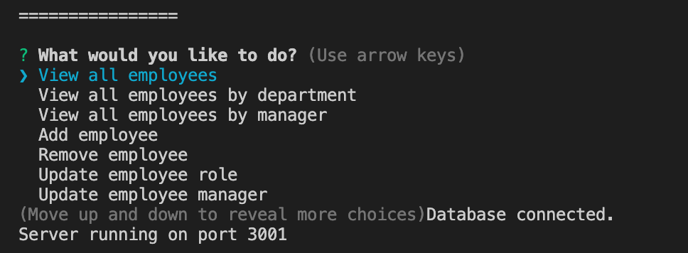

# Employee-Tracker

## Description
A sql database with a terminal UI that allows companies and organizations to keep track of their ever-changing employee roster. Employee-Tracker keeps track of employee details including name, employee id, role, department, salary, and manager. Users can quickly and easily, using only a few keystrokes, do the following:
Retrieve table of all employees,
Retrieve table of all employees by department,
Retrieve table of all employees by manager,
Add a new employee,
Remove an employee,
Update an employee's role,
Update an employee's manager.

## Languages/Technologies
JavaScript
Node.js
Inquirer
mysql
console.table

## Github repo
https://github.com/thomascupchurch/employee-tracker

## Walkthrough video
https://drive.google.com/file/d/1k8uBPtLuWAIspVEXiM2IQ15X6PO-mVGc/view

## Screenshot

## Credits
Created by Thomas Upchurch
thomascupchurch@gmail.com
github.com/thomascupchurch

